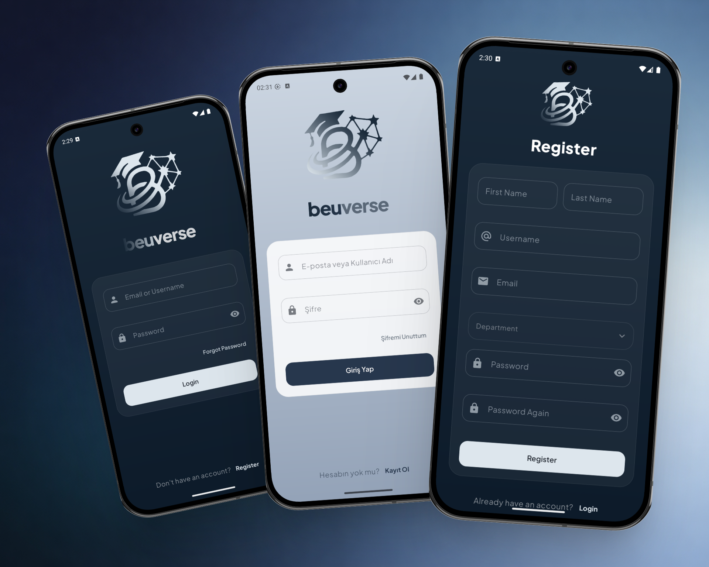
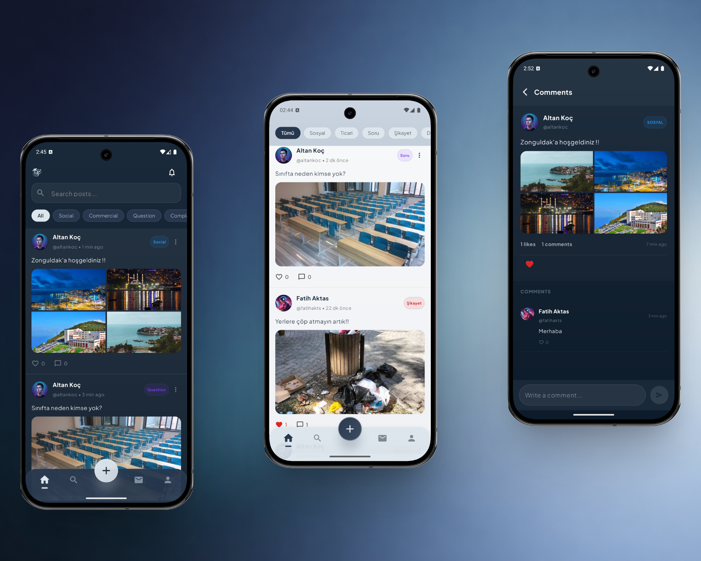
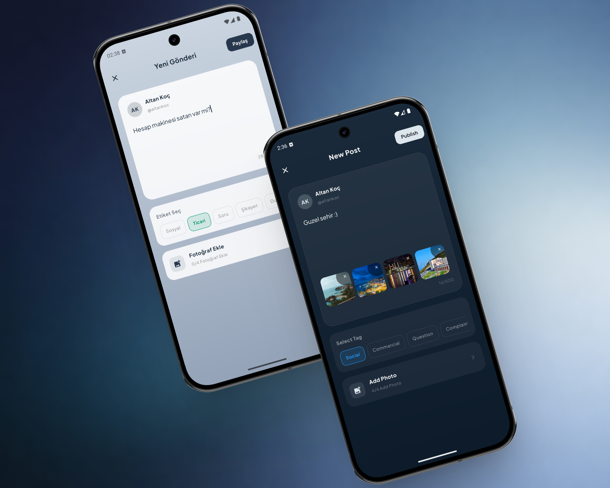
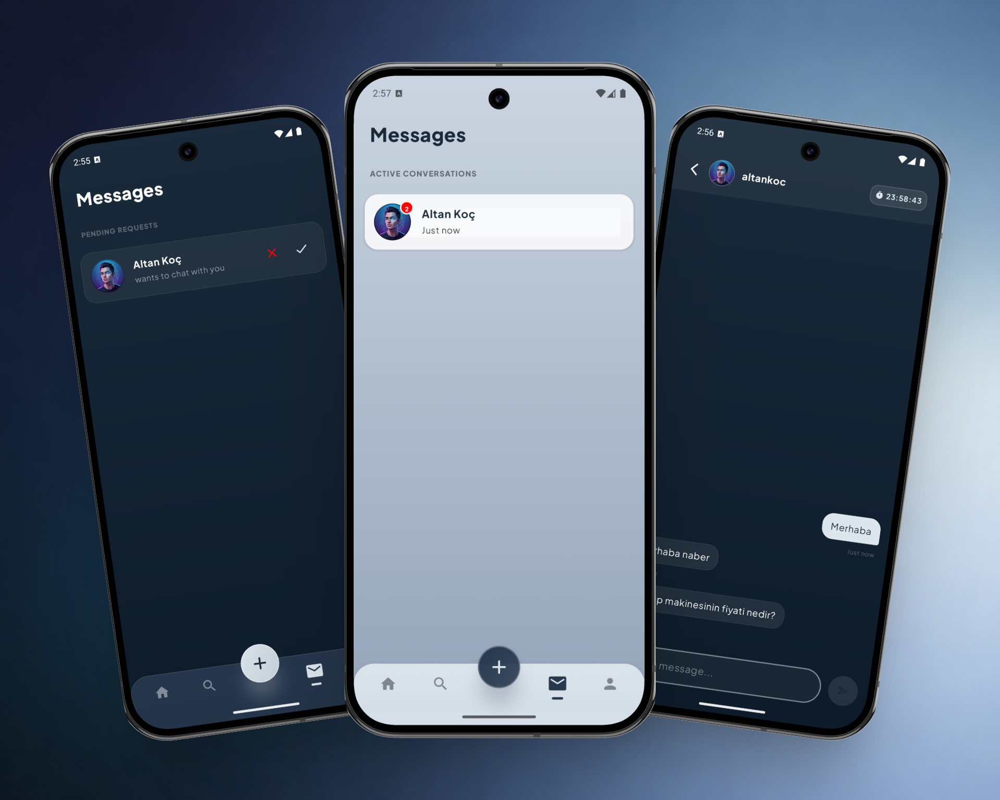
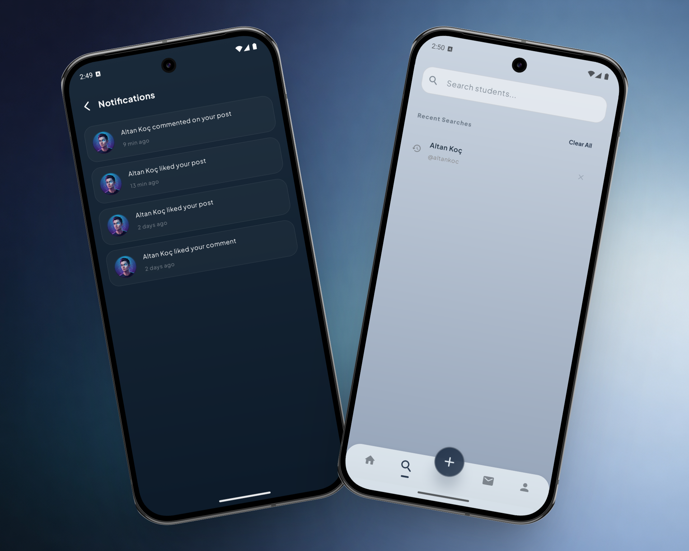
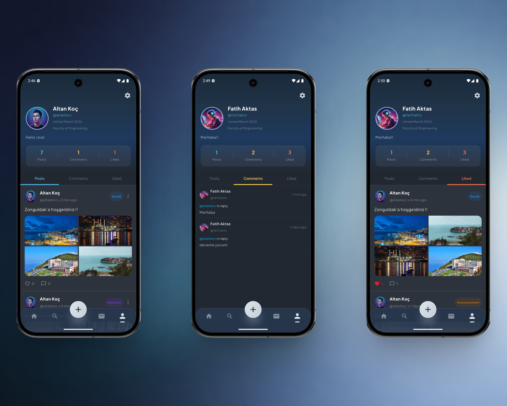

# Beuverse

Beuverse is a private, closed-circuit social platform built exclusively for university students at Bülent Ecevit University. Students can register, share posts, message each other in real-time, and stay connected within their campus community.

The app features both dark and light mode, and is powered by a Java Spring Boot backend deployed on AWS.

**Built with:** Kotlin, Jetpack Compose, Clean Architecture, Hilt, WebSocket (STOMP), DataStore


## Authentication

Only verified university students can join Beuverse. Registration requires a valid Bülent Ecevit University email address. After signing up, a verification email is sent to the student's inbox. The account is activated only after confirming the email, ensuring that the platform remains exclusive to real students.



## Home & Post Detail

The home screen displays a feed of posts shared by students. Posts can be searched by keyword or filtered by tags. Students can like and comment on any post.

Posts tagged as **Question** or **Commercial** include a direct message button, allowing students to reach out to the author privately for help or further discussion.



## Create Post

Students can create posts with up to 500 characters and attach up to 4 images. Each post must include a tag to categorize it. Keep in mind that selecting the **Question** or **Commercial** tag allows other students to send you a message request about your post.



## Messages

When a student sends a message request, the recipient can choose to accept or decline it. Once accepted, a temporary conversation opens between the two students, lasting **24 hours**. After the time expires, the conversation is automatically deleted. This ensures a safe and respectful environment where students can communicate without being disturbed.



## Search & Notifications

Students receive real-time notifications when someone likes or comments on their post, or likes their comment.

The search screen allows students to find and visit other student profiles by name. Recent searches are saved for quick access and can be cleared at any time.



## Profile

Students can customize their profile by changing their nickname, profile picture, and adding a bio. The profile screen displays all shared posts, comments, and liked posts in one place. Students can also browse other students' profiles.

Account management options include logging out or deleting the account. Deleted accounts are soft-deleted and permanently removed from the system after a certain period through the backend.



## Features

- University-exclusive registration with email verification
- Dark and light theme support
- Real-time feed with search and tag-based filtering
- Post creation with up to 4 images and 500 character limit
- Like and comment system with real-time notifications
- Message requests for Question and Commercial tagged posts
- Temporary 24-hour conversations for student privacy
- Student profile search with saved search history
- Customizable profile with nickname, photo, and bio
- Soft delete account management

---

## API Endpoints

| Method | Endpoint | Description |
|--------|----------|-------------|
| POST | `/auth/login` | Login with email or username |
| POST | `/auth/register` | Register with university email |
| GET | `/posts` | Get paginated feed |
| GET | `/posts/search` | Search posts by keyword |
| GET | `/posts/tag/{tag}` | Filter posts by tag |
| POST | `/posts` | Create a new post |
| DELETE | `/posts/{id}` | Delete a post |
| POST | `/posts/{id}/images` | Upload post images |
| POST | `/likes/toggle/{postId}` | Toggle like on a post |
| GET | `/comments/post/{postId}` | Get comments for a post |
| POST | `/comments` | Create a comment |
| GET | `/students/me` | Get current user profile |
| PUT | `/students/me` | Update profile |
| GET | `/students/{id}` | Get student profile by ID |
| GET | `/students/{id}/posts` | Get posts by student |
| GET | `/students/{id}/comments` | Get comments by student |
| GET | `/students/{id}/liked-posts` | Get liked posts by student |
| GET | `/conversations` | Get all conversations |
| GET | `/conversations/{id}/messages` | Get messages in a conversation |
| POST | `/messages` | Send a message |
| GET | `/notifications` | Get notifications |
| GET | `/notifications/unread-count` | Get unread notification count |
| PUT | `/notifications/{id}/read` | Mark notification as read |

---

## Tech Stack

| Layer | Technology |
|-------|------------|
| Language | Kotlin |
| UI Framework | Jetpack Compose with Material3 |
| Architecture | Clean Architecture (Data / Domain / Presentation) |
| Dependency Injection | Hilt (Dagger) |
| Networking | Retrofit + OkHttp + Gson |
| Real-time Communication | WebSocket with STOMP Protocol |
| Local Storage | Jetpack DataStore (Preferences) |
| Navigation | Jetpack Navigation Compose (Type-safe) |
| State Management | StateFlow + ViewModel |
| Image Loading | Coil |
| Animation | Lottie |
| Async Operations | Kotlin Coroutines + Flow |

---

## Architecture

Beuverse is built on top of **Clean Architecture** principles combined with a **feature-based modular structure**, making the codebase highly scalable, testable, and easy to maintain. Every feature in the app is self-contained with its own data, domain, and presentation layers, keeping concerns clearly separated.

### Data Layer

The data layer is responsible for all external communication. Each feature defines its own Retrofit API interface, request/response DTOs, and mapper functions that convert raw API responses into clean domain models. Repository implementations live here, wrapping API calls in Kotlin `Flow` streams and emitting `Resource` states (Loading, Success, Error) so the upper layers never deal with raw network logic. Hilt modules in each feature provide all necessary dependencies through constructor injection.

### Domain Layer

The domain layer is the core of the application and has **zero framework dependencies**. It contains pure Kotlin data classes representing business models, repository interfaces that define contracts for the data layer, and use cases that encapsulate individual business actions. Every use case follows the **Single Responsibility Principle** — for example, `ToggleLikeUseCase` handles only like/unlike logic, `CreatePostUseCase` handles only post creation, and `GetFeedUseCase` handles only feed retrieval with pagination. Use cases are invoked via Kotlin's `operator fun invoke()`, keeping the calling code clean and expressive.

### Presentation Layer

The entire UI is built with **Jetpack Compose** and **Material3**. Each screen has a dedicated `ViewModel` annotated with `@HiltViewModel`, which exposes UI state through `StateFlow`. This ensures a **unidirectional data flow** — the UI observes state reactively and dispatches user actions to the ViewModel, which then delegates work to the appropriate use case. The app supports both **dark and light themes** with a custom color palette and uses the **Jakarta Sans** font family for a modern look.

### Core Module

The `core` module acts as the backbone of the entire application, providing shared infrastructure that every feature depends on:

- **Network Configuration** — A centralized Retrofit and OkHttp setup with an `AuthInterceptor` that automatically injects the Bearer token into every outgoing request, so individual features never worry about authentication headers.
- **Token Management** — `TokenManager` built on Jetpack DataStore persists the access token, user ID, username, and profile photo across sessions securely.
- **WebSocket** — `StompManager` handles real-time communication over WebSocket using the STOMP protocol, enabling instant message delivery in the chat feature.
- **Navigation** — A type-safe navigation graph using sealed classes for route definitions, with support for path parameters, bottom navigation state management, and conditional UI elements like unread message badges.
- **Reusable UI Components** — Shared composables like `PostCard`, `BottomNavBar`, `BeuverseTextField`, `BeuverseButton`, and `BeuverseDropdown` ensure visual consistency and reduce code duplication across features.
- **Utilities** — A `Resource` sealed class for unified state handling, `TimeUtils` for human-readable timestamps, `DepartmentUtils` for mapping department codes, and `MultipartUtils` for image upload preparation.

### Project Structure

```
com.altankoc.beuverse
├── core
│   ├── di
│   ├── datastore
│   ├── network
│   ├── websocket
│   ├── navigation
│   ├── ui
│   └── utils
└── feature
    ├── auth
    ├── home
    ├── post
    ├── messages
    ├── profile
    ├── search
    └── notification
```

---

## Design Pattern

Beuverse follows the **MVVM (Model-View-ViewModel)** design pattern integrated within the Clean Architecture structure:

- **Model** — Domain models and repository interfaces define the business data and contracts. Use cases act as the bridge between ViewModels and repositories, encapsulating business rules in isolated, reusable units.
- **View** — Jetpack Compose screens act as the view layer. They are purely declarative, observe state from the ViewModel, and contain no business logic. User interactions are forwarded to the ViewModel as events.
- **ViewModel** — Each screen has a dedicated `@HiltViewModel` that manages UI state using `StateFlow`. ViewModels receive user actions, delegate work to use cases, and update the state accordingly. This creates a clear unidirectional data flow: UI observes state → user interacts → ViewModel processes → state updates → UI recomposes.

This combination of MVVM + Clean Architecture + Hilt ensures that every layer is independently testable, business logic is never coupled to the Android framework, and adding new features requires minimal changes to existing code.

---

## Getting Started

### Prerequisites

- Android Studio Hedgehog or later
- JDK 11+
- Android SDK 24+ (min) / 35 (target)

### Setup

1. Clone the repository
```bash
git clone https://github.com/altankocdev/beuverse-android-app.git
```

2. Open the project in Android Studio
3. Sync Gradle dependencies
4. Run the app on an emulator or physical device

The app connects to the live backend hosted on AWS. No additional backend setup is required.

---

## Related

- **Backend Repository** → [beuverse-backend](https://github.com/altankocdev/beuverse-backend)

---

## 📄 License
This project is licensed under the MIT License - see the [LICENSE](LICENSE) file for details.

## 👨‍💻 Developer
**Altan Koç**
* GitHub: [@altankocdev](https://github.com/altankocdev)

---
⭐ **If you found this project helpful, please give it a star!** ⭐

---
*Built with ❤️ using Kotlin and Jetpack Compose*


